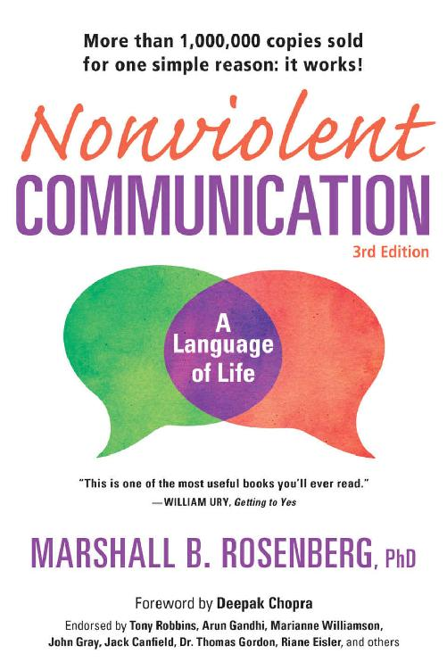

--------------------------------------------------------------------------------------------------------

# Nonviolent COMMUNICATION: A Language of Life(3rd Edition)

**Author: MARSHALL B. ROSENBERG, phd**

> "This is one of the most useful books you'll ever read." -- WILLIAM URY, Getting to Yes.

Foreword by **Deepak Chopra**

Endorsed by **Tony Robbins**, **Arun Gandhi**, **Marianne Williamson**, **John Gray**, **Jack Canfield**, **Dr. Thomas Gordon**, **Riane Eisler**, and others

---

## Copyright

Nonviolent COMMUNICATION: A Language of Life

© 2015 PuddldleDancer Press

A PuddleDancer Press Book

<pre class="stext autowrap prechange" style="background-color:transparent">

All right reserved. No part of this publication may be reproduced, distributed, or transmitted in any form or by any means, including photocopying, recording, or other mechanical or electronic methods, without the prior written permission of the publisher, except for use as brief quoations embodied in crital reviews and certain other noncommercial uses as permitted by copyright law. To request permission, contact the publisher at the following address, "Attention: Permissions Coordinator."

PuddleDancer Press, Permissions Dept.
2240 Encinitas Blvd., Ste. D-911, Encinitas, CA 92024
Tel: 1-760-652-5754 Fax: 1-760-274-6400
<a href="www.NonviolentCommunication.com">www.NonviolentCommunication.com</a>   <a href="Email@PuddleDancer.com">Email@PuddleDancer.com</a>

Ordering Information
Please contact Independent Publishers Group, Tel: 312-337-0747; Fax: 312-337-5985;
Email: <a href="frontdesk@ipgbook.com">frontdesk@ipgbook.com</a> or visit <a href="www.IPGbook.com">www.IPGbook.com</a> for other contact information and details about ordering online

    Author: Marshall B. Rosenberg, PhD
    Editor: Lucy Leu
    Copyeditor: Kyra Freestar
    Project director: Jeanne Iler
    Cover and interior design: Lightbourne (www.lightbourne.com)
    Phyllis Linn, INDEXPRESS and Kathleen Strattan, EDITORIAL SUPPORT SERVICES

Manufactured in the United States of America
3rd Edition, 1st Printing, September 2015

10 9 8 7 6 5 4 3 2 1

ISBN: 978-1-892005-28-1
</pre>

*
Library of Congress Cataloging-in-Publication Data
*

<pre class="stext autowrap prechange" style="background-color:transparent">

Rosenberg, Marshall B.
  Nonviolent communication : a language of life / Marshall B. Rosenberg, PhD. — 3rd edition.
    pages cm
  ISBN 978-1-892005-28-1 (trade paper : alk. paper)
1. Interpersonal communication. 2. Interpersonal relations. 3. Nonviolence. I. Title.
  BF637.C45R645 2015
  153.6—dc23
                                                  2015011660
</pre>

--------------------------------------------------------------------------------------------------------

## What People Are Saying About Nonviolent CommunicationTM

### Relationships:

> Marshall Rosenberg's dynamic communication techniques transform potential conflicts into peaceful dialogues. You'll learn simple tools to defuse arguments and create compassionate connections with your family, friends, and other acquaintances."
>                                  -- **JOHN GRAY**, author, Men Are From Mars, Women Are From Venus

--------------------------------------------------------------------------------------------------------
--------------------------------------------------------------------------------------------------------
--------------------------------------------------------------------------------------------------------

<!--

# backup

All right reserved. No part of this publication may be reproduced, distributed, or transmitted in any form or by any means, including photocopying, recording, or other mechanical or electronic methods, without the prior written permission of the publisher, except for use as brief quoations embodied in crital reviews and certain other noncommercial uses as permitted by copyright law. To request permission, contact the publisher at the following address, "Attention: Permissions Coordinator."

PuddleDancer Press, Permissions Dept.

2240 Encinitas Blvd., Ste. D-911, Encinitas, CA 92024

Tel: 1-760-652-5754 Fax: 1-760-274-6400

www.NonviolentCommunication.com   Email@PuddleDancer.com

Ordering Information 
Please contact Independent Publishers Group, Tel: 312-337-0747; Fax: 312-337-5985; 
Email: <a href="frontdesk@ipgbook.com">frontdesk@ipgbook.com</a> or visit <a href="www.IPGbook.com">www.IPGbook.com</a> for other contact information and details about ordering online

 

&nbsp;&nbsp;&nbsp;&nbsp;Author: Marshall B. Rosenberg, PhD 
&nbsp;&nbsp;&nbsp;&nbsp;Editor: Lucy Leu 
&nbsp;&nbsp;&nbsp;&nbsp;Copyeditor: Kyra Freestar 
&nbsp;&nbsp;&nbsp;&nbsp;Project director: Jeanne Iler 
&nbsp;&nbsp;&nbsp;&nbsp;Cover and interior design: Lightbourne (www.lightbourne.com) 
&nbsp;&nbsp;&nbsp;&nbsp;Phyllis Linn, INDEXPRESS and Kathleen Strattan, EDITORIAL SUPPORT SERVICES 

 

Manufactured in the United States of America

3rd Edition, 1st Printing, September 2015

10 9 8 7 6 5 4 3 2 1

ISBN: 978-1-892005-28-1

*
Library of Congress Cataloging-in-Publication Data
*

Rosenberg, Marshall B. 
Nonviolent communication : a language of life / Marshall B. Rosenberg, PhD. — 3rd edition. 
 pages cm 
ISBN 978-1-892005-28-1 (trade paper : alk. paper) 
1. Interpersonal communication. 2. Interpersonal relations. 3. Nonviolence. I. Title. 
BF637.C45R645 2015 
153.6—dc23 
2015011660 

-->
