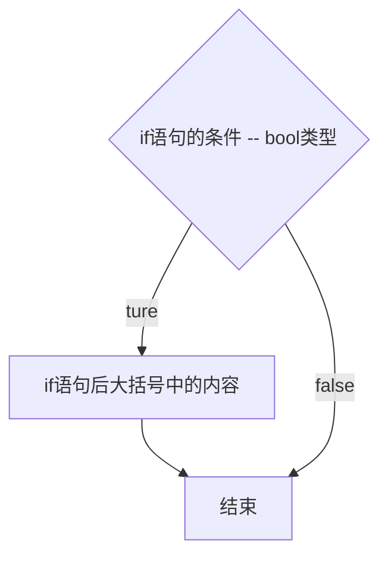

<!-- vim-markdown-toc Redcarpet -->

* [GOROOT](#goroot)
* [GOPATH](#gopath)
* [数据类型](#数据类型)
    - [基本数据类型](#基本数据类型)
        + [布尔类型bool](#布尔类型bool)
    - [数值类型](#数值类型)
        + [整型](#整型)
        + [浮点型](#浮点型)
        + [xx型](#xx型)
        + [字符串string](#字符串string)
    - [复合数据类型](#复合数据类型)
* [print&scan](#print-amp-scan)
    - [fmt包：输入、输出](#fmt包：输入、输出)
    - [bufio包](#bufio包)
* [占位符](#占位符)
* [转义字符](#转义字符)
* [Naming Rule命名规则](#naming-rule命名规则)
    - [变量命名](#变量命名)
    - [常量命名](#常量命名)
* [Main](#main)
* [Comment注释](#comment注释)
    - [**single line comment**](#single-line-comment)
    - [**multi line comment**](#multi-line-comment)
* [Import](#import)
* [Compile编译](#compile编译)
* [variable变量](#variable变量)
    - [变量的定义](#变量的定义)
    - [变量的调用](#变量的调用)
    - [全局变量](#全局变量)
* [constant常量](#constant常量)
    - [常量的定义](#常量的定义)
* [iota](#iota)
* [if](#if)

<!-- vim-markdown-toc -->

---

## GOROOT

GOROOT is GOLANG installation directory. Also is a Environment Variable and needs be written into system setting.

<br>

---

## GOPATH

Gopath is Go workspace that save all GO project and code file.

> Go code file `MUST` work in `GOPATH`.

> In Ubuntu, the default GOPATH is `/HOME/go`.

There are three subdirectory in `GOPATH`:

> `src` -- In **src**, every subdirectory is a package. Source code files are stored in package.
> `pkg` -- When compilation is done, GOLANG will creat a result file in here.
> `bin` -- A folder full of generated executable file.


## 数据类型

### 基本数据类型

#### 布尔类型bool

取值

### 数值类型

#### 整型
#### 浮点型
#### xx型

#### 字符串string

定义 
```
var s1 string
s1 = "王二狗"
```

```
"hello`world`"
```

可以正常输出 ` 号

反过来

```
`hello"world"`
```

也可以正常输出 `"` 号

### 复合数据类型

<br>

---

## print&scan

### fmt包：输入、输出

Print() // 打印

Printf()  // 格式化打印（即后面加占位符）

Println()  // 打印之后换行

Scanln()  // 读取键盘的输入，通过操作地址，赋值给x和y（阻塞式）

Scanf()  // 

> 所有的键盘输入都是阻塞式的

### bufio包

```Go
fmt.Println("请输入一个字符串：")
reader := bufio.NewReader(os.Stdin)
s1,_ := reader.ReadString('\n')
fmt.Println("读到的数据：", s1)
```

<br>

---


## 占位符

一般用于Printf()的格式化打印中

| 输入  | 输出                   |
| :---: | :---:                  |
| %T    | 显示变量是什么数据类型 |
| %v    | 原样输出               |
| %d    | 十进制整数             |
| %t    | bool类型               |
| %f    | 浮点类型               |
| %s    | 字符串                 |
| %b    | 二进制整数             |
| %o    | 八进制整数             |
| %c    | character              |
| %p    | 内存地址               |
| %x    | 16进制 0-9, a-f        |
| %X    | 16进制 0-9, A-F        |

<br>

---

## 转义字符

| 输入  | 输出   |
| :---: | :---:  |
| \n    | 换行   |
| \t    | 制表符 |
| \"    | "      |

<br>

---

## Naming Rule命名规则

### 变量命名


### 常量命名

所有字母都要大写

<br>

---

## Main

用于声明一个文件是主文件main，即这个项目starts from here。

> main文件在教学中又被称为：命令源码文件。

```Go
package main

func main(){
    // 主函数内容
}
```

<br>

---

## Comment注释

### **single line comment**

```Go
// single line comment
```

### **multi line comment**

```Go
/* multi line comment
   You can type within this section */
```

or

```Go
/*
1st line
2nd line
...
*/
```

<br>

---

## Import

**Format:** `import "package name"`

**Example:**

```Go
import "fmt"
```

<br>

---

## Compile编译

使用terminal进入项目文件夹内，运行`go build`命令进行编译。

> `go build`命令具体用法请查看`Command`文档。

<br>

---

## variable变量

### 变量的定义

变量的定义有两种方法：

* **指定变量类型**

**Format:** 

```Go
var name type
name = value
```

或

```Go
var name type = value
```

**Example:**

```Go
var num1 int   // 变量的定义
num1 = 30      // 变量的赋值

var num2 int = 100
```

* **类型推断Type inference**（由Go去根据值判断变量类型）
 
**Format:** 

```Go
var name = value
```

还可以使用简短定义（或叫简短声明）

> 简短定义方法不能用在全局变量中

```Go
name := value
```

**Example:**

```Go
var num1 = 30

num2 := 100
```

* **多个变量同时定义**

```Go
var a, b, c int
a = 1
b = 2
c = 3
fmt.Println(a, b, c)
```

Or

```Go
// 同一类型
var m, n int = 100, 200
fmt.Println(m, n)

// 不同类型
var n1, f1, s1 = 100, 3.14, "Go"
fmt.Println(n1, f1, s1)

// 集合类型
var (
    studentName = "Lily"
    age = 18
    sex = "female"
)
fmt.Printf("学生姓名：%s，年龄：%d，性别：%s\n", studentName, age, sex)
```

### 变量的调用


### 全局变量

<br>

---

## constant常量

### 常量的定义

常量命名约定俗成要全部大写。

**Format:** `const identifier [type] = value`

* 显式类型定义： `const b string = "abc"`
* 隐式类型定义： `const b = "abc"`

<br>

---

## iota

* 每当定义一个const，iota的初始值为0。
* 每当定义一个常量，iota就会自动累加1。
* 直到下一个const出现，iota归0。

<br>

---

## if

语法格式：

```Go
if 条件表达式{
    //
}
```



<br>

---
