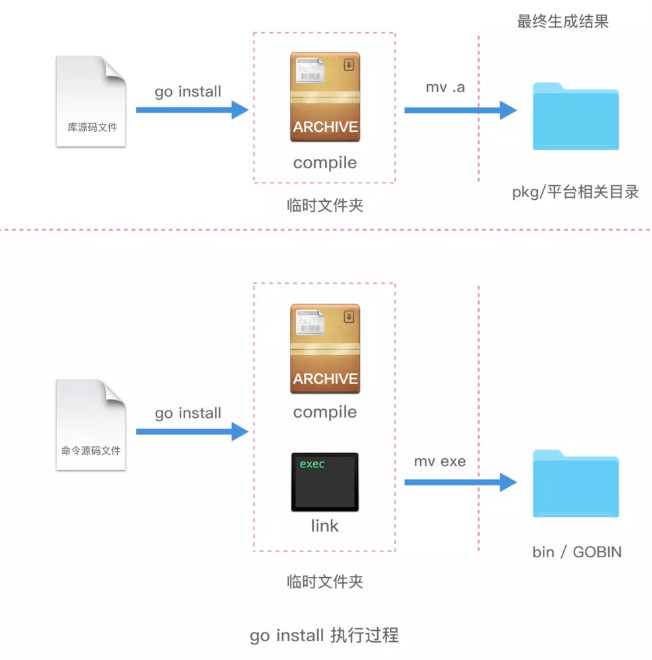

<!-- vim-markdown-toc Redcarpet -->

* [Write in front](#write-in-front)
* [go help](#go-help)
* [go run](#go-run)
* [go build](#go-build)
* [go install](#go-install)
* [go get](#go-get)
* [go fmt](#go-fmt)
* [go test](#go-test)
* [go doc](#go-doc)

<!-- vim-markdown-toc -->

## Write in front

* in command, "[]" means optional

## go help

Help is help, just help~~

## go run

Direct run go file without compile.

> usually for main file

**Format:** `go run [filename.go]`


## go build

Compile current path program (compile *.go file into *.exe file), or compile the specified [filename.go] file.

> `go build` will ignore the *.go file which starts with "_" or "." in current path.(EK: just current path? If this package import other package?)

**Format:** `go build [filename.go]`


**Parameters**

| Parameter |            Explain             | Example                 | Effect                                      |
| :---:     |             :---:              | :---:                   | :---:                                       |
| NULL      | 编译当前文件夹下的所有*.go文件 | go build                | Compile all the *.go file in current folder |
| o         |    指定一个文件名来进行编译    | go build -o filename.go | Compile the "filename.go" file              |
| n         |                                |                         |                                             |


* 跨平台编译

`go build`默认得到的是当前操作系统的可执行文件，下面介绍在一个系统下编译另一个系统的可执行文件。

以**编译Linux平台64位程序**为例：

在terminal下指定目标操作系统的平台和处理器架构

```Go
SET CGO_ENABLED=0  // 禁用CGO
SET GOOS=linux  // 目标平台是linux
SET GOARCH=amd64  // 目标处理器架构是amd64
```

> 使用了cgo的代码是不支持跨平台编译的

设置好后正常使用`go build`进行编译即可得到Linux下的可执行文件。

对其他系统进行编译的操作方法也是一样，只需要把`SET GOOS=系统名`进行对应更换即可，其中windows平台就是填写`windows`，linux平台就是`linux`，而Mac是`darwin`，其它不变。


## go install

`go install`就是直接把编译生成exe文件放置到`GOPATH`的`bin`目录下。因为环境变量中配置了`GOPATH`的`bin`目录，所以可以在任何路径运行可执行文件。

**Format:** `go install [package_name]`

在任意路径下执行`go install package_name`，Go会自动在`GOROOT`及`GOPATH`下的`src`目录寻找对应名字为“package_name”的包（文件夹）进行编译；如果当前已经在某个package文件夹下，则可以直接执行`go install`编译。




## go get

**Format:** `go get [parameter] package_name`

**Parameters**

| Parameter |            Explain             | Example                 | Effect                                      |
| :---:     |             :---:              | :---:                   | :---:                                       |
| x         |                                |                         |                                             |

## go fmt

## go test

## go doc

官方文档查询工具

`godoc -http=:端口号` 创建一个本地网站服务，创建后通过访问`localhost:端口号`或`127.0.0.1:端口号`<++>可查看官方文档，端口数值可更改。

