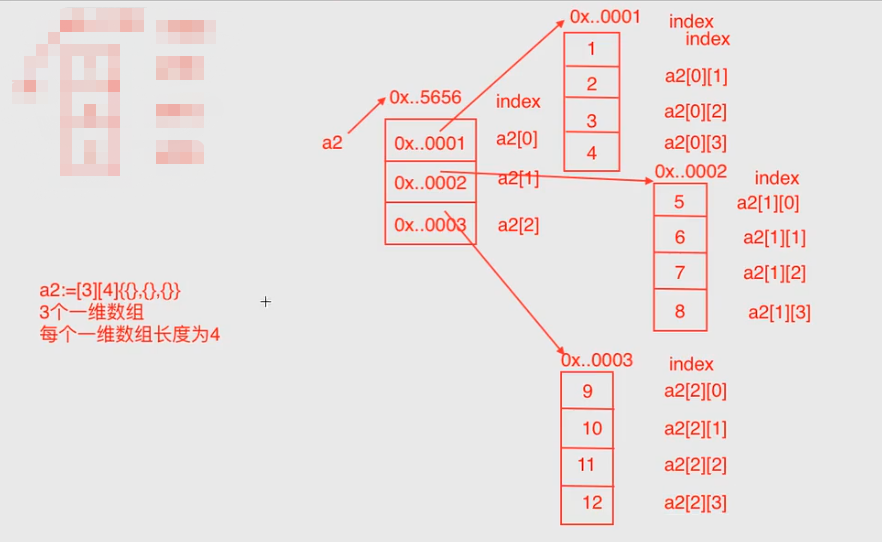
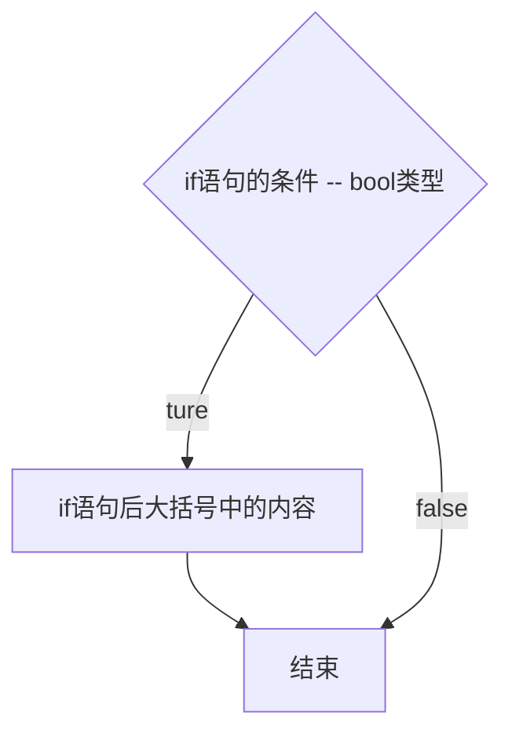
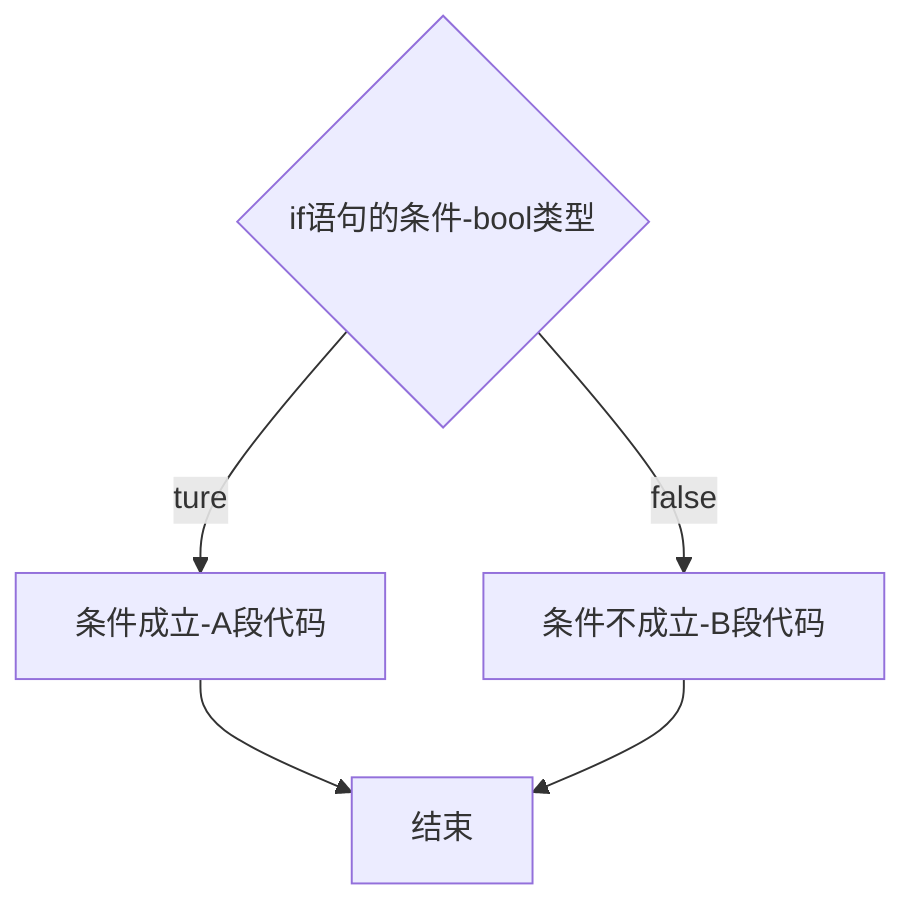

<!-- vim-markdown-toc Redcarpet -->

* [Go手册](#go手册)
* [GOROOT](#goroot)
* [GOPATH](#gopath)
* [深拷贝和浅拷贝](#深拷贝和浅拷贝)
* [数据类型](#数据类型)
    - [基本数据类型](#基本数据类型)
        + [bool布尔类型](#bool布尔类型)
    - [数值类型](#数值类型)
        + [int整型](#int整型)
        + [float浮点型](#float浮点型)
        + [xx型](#xx型)
        + [字符串string](#字符串string)
    - [复合数据类型](#复合数据类型)
        + [array数组](#array数组)
            * [range](#range)
            * [array的数据类型](#array的数据类型)
            * [二维数组](#二维数组)
* [print&scan](#print-amp-scan)
    - [fmt包：输入、输出](#fmt包：输入、输出)
    - [bufio包](#bufio包)
* [占位符](#占位符)
* [转义字符](#转义字符)
* [Naming Rule命名规则](#naming-rule命名规则)
    - [变量命名](#变量命名)
    - [常量命名](#常量命名)
* [Main](#main)
* [Comment注释](#comment注释)
    - [**single line comment**](#single-line-comment)
    - [**multi line comment**](#multi-line-comment)
* [Import](#import)
* [Compile编译](#compile编译)
* [variable变量](#variable变量)
    - [变量的定义](#变量的定义)
    - [变量的调用](#变量的调用)
    - [全局变量](#全局变量)
* [constant常量](#constant常量)
    - [常量的定义](#常量的定义)
* [iota](#iota)
* [if](#if)
* [if...else...](#if-else)
* [switch](#switch)
* [for](#for)
* [goto](#goto)
* [map集合](#map集合)

<!-- vim-markdown-toc -->

---

## Go手册

https://golang.google.cn/

## GOROOT

GOROOT is GOLANG installation directory. Also is a Environment Variable and needs be written into system setting.

<br>

---

## GOPATH

Gopath is Go workspace that save all GO project and code file.

> Go code file `MUST` work in `GOPATH`.

> In Ubuntu, the default GOPATH is `/HOME/go`.

There are three subdirectory in `GOPATH`:

> `src` -- In **src**, every subdirectory is a package. Code files are stored in package.
> `pkg` -- When a program has been compiled, the compiled file will be created here.
> `bin` -- A folder of generated executable file.

<br>

---

## 深拷贝和浅拷贝


<br>

---


## 数据类型

### 基本数据类型

数值、浮点、字符串

#### bool布尔类型

取值

### 数值类型

#### int整型
#### float浮点型
#### xx型

#### 字符串string

定义 
```
var s1 string
s1 = "王二狗"
```

```
"hello`world`"
```

可以正常输出 ` 号

反过来

```
`hello"world"`
```

也可以正常输出 `"` 号

### 复合数据类型

包含array, slice, map, struct, pointer, interface, function, channel ...

#### array数组

**概念：** 存储一组相同数据类型的数据结构。可理解为容器，存储一组数据。

array开辟的是连续的内存。

`var arr_name [n] type`

`var arr_name = [n] type{element1, element2...}` 

`arr_name := [...]type{element...}`

> n is a number for the array.

example: 

```Go
var arr1 [4] int
arr1[0] = 1
arr1[1] = 2
arr1[2] = 3
arr1[3] = 4
fmt.Println(arr1[0])  // 打印array的第一个数值
fmt.Println(arr1[2])  // 打印array的第三个数值

fmt.Println("数组的长度：", len(arr1))  //  容器中实际存储的数据量
fmt.Println("数组的容量：", cap(arr1))  //  容器中能够存储的最大数据量

// 数组的其它创建方式
var a [4] int // 同 var a = [4] int
var b = [4]int{1,2,3,4}
var c = [5]int{1,2,4}
var d = [5]int{1:1,3:2}
var e = [5]int{1:1,3:2}
.
.
.
<++>
```

##### range

用于数组的遍历。

```Go
for index, value := range arr1{
    fmt.Printf("下标是：%d，数值是：%d\n", index, value)
}
```

##### array的数据类型

`[size]type`

##### 二维数组

> 多维数组同理

二维数组的定义：

```Go
a2 := [3][4]{{},{},{}}
```

意思是，二维数组a2有三个元素，每一个元素指向一个含有4个元素的数组的内存地址。即共有3 * 4 = 12个。



* a2 是一个二维数组
* len(a2) 二维数组的长度，其实就是二维数组足的一维数组的个数。（这里是3，即第一层的数量）
* a2[0] 第一个一维数组
* len(a2[0]) 二维数组里面的第一个一维数组的长度（这里是4，即第二层第一个）
* a2[0][0] 第一个一维数组足的第一个元素

---

## print&scan

### fmt包：输入、输出

Print() // 打印

Printf()  // 格式化打印（即后面加占位符）

Println()  // 打印之后换行

Scanln()  // 读取键盘的输入，通过操作地址，赋值给x和y（阻塞式）

Scanf()  // 

> 所有的键盘输入都是阻塞式的

### bufio包

```Go
fmt.Println("请输入一个字符串：")
reader := bufio.NewReader(os.Stdin)
s1,_ := reader.ReadString('\n')
fmt.Println("读到的数据：", s1)
```

<br>

---


## 占位符

一般用于Printf()的格式化打印中

| 输入  | 输出                   |
| :---: | :---:                  |
| %T    | 显示变量是什么数据类型 |
| %v    | 原样输出               |
| %d    | 十进制整数             |
| %t    | bool类型               |
| %f    | 浮点类型               |
| %s    | 字符串                 |
| %b    | 二进制整数             |
| %o    | 八进制整数             |
| %c    | character              |
| %p    | 内存地址               |
| %x    | 16进制 0-9, a-f        |
| %X    | 16进制 0-9, A-F        |

<br>

---

## 转义字符

| 输入  | 输出   |
| :---: | :---:  |
| \n    | 换行   |
| \t    | 制表符 |
| \"    | "      |

<br>

---

## Naming Rule命名规则

### 变量命名


### 常量命名

所有字母都要大写

<br>

---

## Main

用于声明一个文件是主文件main，即这个项目starts from here。

> main文件在教学中又被称为：命令源码文件。

```Go
package main

func main(){
    // 主函数内容
}
```

<br>

---

## Comment注释

### **single line comment**

```Go
// single line comment
```

### **multi line comment**

```Go
/* multi line comment
   You can type within this section */
```

or

```Go
/*
1st line
2nd line
...
*/
```

<br>

---

## Import

**Format:** `import "package name"`

**Example:**

```Go
import "fmt"
```

<br>

---

## Compile编译

使用terminal进入项目文件夹内，运行`go build`命令进行编译。

> `go build`命令具体用法请查看`Command`文档。

<br>

---

## variable变量

### 变量的定义

变量的定义有两种方法：

* **指定变量类型**

**Format:** 

```Go
var name type
name = value
```

或

```Go
var name type = value
```

**Example:**

```Go
var num1 int   // 变量的定义
num1 = 30      // 变量的赋值

var num2 int = 100
```

* **类型推断Type inference**（由Go去根据值判断变量类型）
 
**Format:** 

```Go
var name = value
```

还可以使用简短定义（或叫简短声明）

> 简短定义方法不能用在全局变量中

```Go
name := value
```

**Example:**

```Go
var num1 = 30

num2 := 100
```

* **多个变量同时定义**

```Go
var a, b, c int
a = 1
b = 2
c = 3
fmt.Println(a, b, c)
```

Or

```Go
// 同一类型
var m, n int = 100, 200
fmt.Println(m, n)

// 不同类型
var n1, f1, s1 = 100, 3.14, "Go"
fmt.Println(n1, f1, s1)

// 集合类型
var (
    studentName = "Lily"
    age = 18
    sex = "female"
)
fmt.Printf("学生姓名：%s，年龄：%d，性别：%s\n", studentName, age, sex)
```

### 变量的调用


### 全局变量

<br>

---

## constant常量

### 常量的定义

常量命名约定俗成要全部大写。

**Format:** `const identifier [type] = value`

* 显式类型定义： `const b string = "abc"`
* 隐式类型定义： `const b = "abc"`

<br>

---

## iota

* 每当定义一个const，iota的初始值为0。
* 每当定义一个常量，iota就会自动累加1。
* 直到下一个const出现，iota归0。

<br>

---

## if

语法格式：

```Go
if condition {
    //
}
```

```Go
if statement; condition {
    //
}
```

> 在if里statement的变量，不能在if结构外调用。



<br>

---

## if...else...

```Go
if 条件{
    // 条件成立，执行此处的代码
    A段
}else{
    // 条件不成立，执行此处的代码
    B段
}
```



<br>

---

## switch

```Go
switch var1{
case val1:
    ...
case val2:
    ...
default:
    ...
}
```

if 所有的case都不满足，则使用default。

```Go
switch{
case true:
    fmt.Println("true..")
case false:
    fmt.Println("false..")
```

```Go
switch{
case val1, val3, var4:
    fmt.Println("Good day!")
case val2:
    fmt.Println("Bad day!")
```

```Go
n := 2
switch n {
case 1:
    fmt.Println("我是熊大")
    fmt.Println("我是熊大")
    fmt.Println("我是熊大")
case 2:
    fmt.Println("我是熊二")
    fmt.Println("我是熊二")
    break  // 用于强制结束case，意味着switch被强制结束
    fmt.Println("我是熊二")
case 3:
    fmt.Println("我是光头强")
    fmt.Println("我是光头强")
    fmt.Println("我是光头强")
} 
fmt.Println("main...over...")
```

```Go
m := 2
switch m {
case 1:
    fmt.Println("我是第一，不打印。。")
case 2:
    fmt.Println("我是第二，打印。。")
    fallthrough
case 3:
    fmt.Println("我是第三，打印。。")  // 因为上一个case结尾有fallthrough，所以case3也被执行
case 4:
    fmt.Println("我是第四，不打印。。")
```


**example**

```Go
num := 5
switch num {
case 1:
    fmt.Println("第一季度")
case 2:
    fmt.Println("第二季度")
case 3:
    fmt.Println("第三季度")
case 4:
    fmt.Println("第四季度")
default:
    fmt.Println("数据有误")
}
```

```Go
num1 := 0
num2 := 0
oper := ""
fmt.Println("请输入一个整数：")
fmt.Scanln(&num1)
fmt.Println("请再次输入一个整数：")
fmt.Scanln(&num2)
fmt.Println("请输入一个操作符：+, -, *, /")
fmt.Scanln(&oper)

switch oper{
case "+":
    fmt.Printf("%d + %d = %d\n", num1, num2, num1 + num2)
case "-":
    fmt.Printf("%d - %d = %d\n", num1, num2, num1 - num2)
case "*":
    fmt.Printf("%d * %d = %d\n", num1, num2, num1 * num2)
case "/":
    fmt.Printf("%d / %d = %d\n", num1, num2, num1 / num2)
}
```

```Go
swtich {
case 条件1: 条件1结果
case 条件2: 条件2结果
case 条件3: 条件3结果
}
```

<br>

---

## for

> Go语言的循环结构只有一种 —— for循环，不像其它语言还有while、do while

```Go
for 表达式1; 表达式2; 表达式3{
    循环体
}
```

```Go
for condition {  // 相当于其它语言的while循环
    循环体
}
```

```Go
for {  // 相当于其它语言的while(true)
    循环体
}
```

**example**

```Go
for i := 1; i <= 5; i++ {
    fmt.Println(i)
}
```

和python一样，有`break`和`continue`，用法也一样。但是多了一种贴标签用法，可以结束指定的某个循环（外层循环），类似于给循环取名。见下：

```Go
out: for i:=1; i<=5; i++ {
    for j:=1; j<=5; j++ {
        if j==2 {
            break out  //  或者continue out
        }
}
```

这里的"out"就是贴标签用法。

<br>

---

## goto

> 尽量少使用goto语句，容易造成结构混乱。（要灵活运用）

```Go
goto label;
..
..
label: statement;
```

```Go
var a = 10
LOOP:  // this is a label(can be modified)
for a < 20 {
    if a == 15 {
        a += 1
        goto LOOP
    }
    fmt.Printf("a的值为：%d\n", a)
    a++
}
```

## map集合

> 相当于python的dict？

* map是无序的<++>
* 
