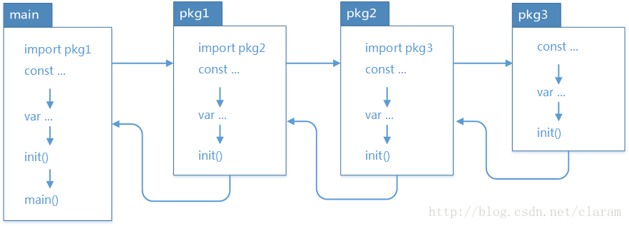
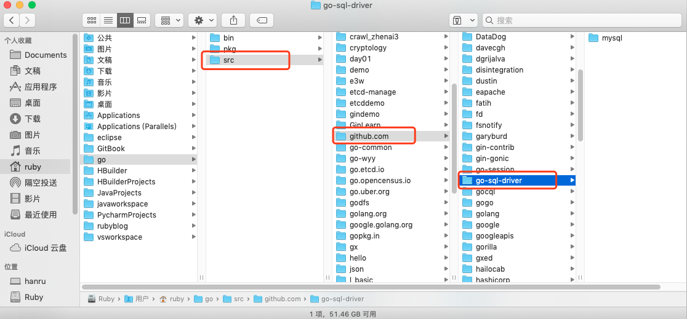

<!-- vim-markdown-toc Redcarpet -->

* [Concept](#concept)
* [二、package](#二、package)
* [三、import](#三、import)
* [四、GOPATH环境变量](#四、gopath环境变量)
* [五、init包初始化](#五、init包初始化)
* [六、管理外部包](#六、管理外部包)
* [扩展](#扩展)

<!-- vim-markdown-toc -->

--------------------------------------------------------------------------------------------------------

https://www.bilibili.com/video/BV1jJ411c7s3?p=101


**参考：** 一个项目示例，项目名“myblog”的包目录结构。

```
myblog
├── conf
│   └── app.conf
├── controllers
│   ├── aboutme_controller.go
│   ├── add_article_controller.go
│   ├── album_controller.go
│   ├── base_controller.go
│   ├── default.go
│   ├── delete_article_controller.go
│   ├── exit_controller.go
│   ├── home_controller.go
│   ├── login_controller.go
│   ├── register_controller.go
│   ├── show_article_controller.go
│   ├── tags_controller.go
│   ├── update_article_controller.go
│   └── upload_controller.go
├── main.go
├── models
│   ├── album_model.go
│   ├── article_model.go
│   ├── home_model.go
│   ├── tags_model.go
│   └── user_model.go
├── myblogweb
├── routers
│   └── router.go
├── static
│   ├── css
│   │   ├── blogsheet.css
│   │   └── lib
│   │       ├── highlight.css
│   │       └── login.css
│   ├── img
│   ├── js
│   │   ├── blog.js
│   │   ├── lib
│   │   │   ├── jquery-3.3.1.min.js
│   │   │   └── jquery.url.js
│   │   └── reload.min.js
│   └── upload
│       └── img
│           └── 2018
│               └── 12
│                   └── 11
│                       ├── 1544511378-bee2.png
├── tests
│   └── default_test.go
├── utils
│   ├── myUtils.go
│   └── mysqlUtils.go
└── views
    ├── aboultme.html
    ├── album.html
    ├── block
    │   ├── home_block.html
    │   └── nav.html
    ├── home.html
    ├── index.tpl
    ├── login.html
    ├── register.html
    ├── show_article.html
    ├── tags.html
    └── write_article.html
```

## Concept

**Package:**   EK：当项目内容很多的时候，我们需要把不同的代码存放在不同的go文件中，方便管理。当不同类型的go文件需要分类存放时，便出现了package这一概念。我们可以把不同的文件夹理解成不同的package，通过为不同的文件夹定义不同的包名，Go便可以调用不同package中的内容，这样代码的复用就很方便了。

**package包括** 用户自己编写的代码形成的包、Golang官方提供的内置包（如fmt、time等），或者还可以把网上下载的，实现某种功能的框架也算的包（只要用import导入的都算包）


**main包：** 每个项目都应该有一个main包（main()函数所在的包）作为程序的入口，以main作为主体去引用别的代码，这时就需要使用import命令导入了。


## 二、package

`GOPATH`下的 `src` 目录是以代码包的形式组织并保存 Go 源码文件的，每个`src` 目录下的子目录都是一个package。

**包定义：** 同一个目录下的所有.go文件的第一行添加`包定义`，以标记该文件归属的包，语法：

```Go
package 包名
```

定义package需要满足：

- 一个目录下的同级文件归属一个包。也就是说，在同一个包下面的所有文件的package名，都是一样的。
- `package 包名`语句声明的包名可以和对应的目录名不一致，但一般习惯写成一致，方便记忆管理。
- 包名为 main 的包为应用程序的入口包，（EK：main包在一个项目只有唯一一个？），其他包不能使用该名字。


**package的嵌套**

包可以嵌套定义，对应的就是嵌套目录，但包名应该与所在的目录一致，例如：

```
src
├── l_package
│   └── utils
│        ├── timeutils
│        │   └── timeutil.go
│        ├── test1.go
│        └── util.go
└── main.go
```

上面结构中，`test1.go`和`util.go`在首行定义package name，可以是`package utils`，也可以是`package 自定义`，两个文件的package name可以不是文件夹名，但必须一致。

而在“utils”文件夹下的“timeutils”文件夹，则是package的嵌套，在package嵌套的情况下，package name的定义必须和文件夹名一致，也就是说`src/l_package/utils/timeutils/timeutil.go`这个文件的首行，只能是`package timeutils`的package定义语句，名字只能取这个。

在package中，通过标识符首字母是否大写，来确定是否可以被导出。首字母大写才可以被导出，视为 public 公共的资源。

```go
// 文件：qf/ruby/tool.go中
package ruby
// 可以被导出的函数
func FuncPublic() {
}
// 不可以被导出的函数
func funcPrivate() {
}
```

`src/l_package/utils/util.go`中的代码：

```Go
package utils

import "fmt"

func Count() {  // 首字母大写，是public的，可在外部调用
    fmt.Println("utils包下的Count()函数。。。")
}
```

`src/l_package/utils/test1.go`中的代码：

```Go
package utils
```

`src/l_package/utils/timeutils/timeutil.go`中的代码：

```Go
package timeutils

import (
    "fmt"
    "time"
)

func PrintTime() {
    fmt.Println(time.Now())
}
```


## 三、import

要引用其他包，可以使用 import 关键字，默认导入路径是`GOPATH/src/`，所以在使用import导入时，如果使用绝对路径，可以省略前面的`GOPATH/src/`。


A：常规导入

```go
// 单个导入
import "package"
// 批量导入
import (
  "package1"
  "package2"
  )
```

B：用 `.`（点） 导入

> 不建议使用，如果导入package数量多的时候，调用其它包的函数时会混乱。

```go
import(
	. "fmt"
) 
```

这个点操作的含义就是这个包导入之后在你调用这个包的函数时，你可以省略前缀的包名，也就是前面你调

用的`fmt.Println("hello world")`可以省略的写成`Println("hello world")`


C：起别名

别名操作顾名思义我们可以把包命名成另一个我们用起来容易记忆的名字。导入时，可以为包定义别名，语法演示：

```go
import (
  p1 "package1"
  p2 "package2"
  )
// 使用时：别名操作，调用包函数时前缀变成了我们的前缀
p1.Method()
```


D：用 `_`（下划线） 导入
如果仅仅需要导入包时执行初始化操作，并不需要使用包内的其他函数，常量等资源。则可以在导入包时，匿名导入。

这个操作经常是让很多人费解的一个操作符，请看下面这个import：

```Go
import (
   "database/sql"
   _ "github.com/ziutek/mymysql/godrv"
)
```

`_` 操作其实是引入该包，而不直接使用包里面的函数，而是调用了该包里面的init函数。也就是说，使用下划线作为包的别名，会仅仅执行init()。

> 导入的包的路径名，可以是相对路径也可以是绝对路径，推荐使用绝对路径（起始于工程根目录）。

E：同一个包下（即同一个路径下）的互相调用，不需要import。

**下面以代码演示import的用法**

我们继续使用这个结构为例，做代码演示

```
src
├── l_package
│   └── utils
│        ├── timeutils
│        │   └── timeutil.go
│        ├── test1.go
│        └── util.go
└── main.go
```

1. 编辑`main.go`导入其它package

```Go
package main

// import "l_package/utils"  // 绝对路径

import "./utils"  // 相对路径

import "l_package/utils/timeutils"

func main() {
    utils.Count()
    timeutils.PrintTime()
}
```

2. `test1.go`导入同一个包下的`util.go`内的Count()函数

由于同一包下不需要import，所以直接调用就行。

```Go
package utils

func MyTest2(){
    Count()
}
```


3. 加入一个`src/l_package/pk1/test2.go`文件，并且调用utils包中的Count()函数（在/l_package/utils/util.go内），以及timeutils包内的PrintTime()函数。

> 调用其它包内的函数不需要知道该函数的具体所在文件名，只需要知道在哪个包。

```
src
├── pk1
│   └── test2.go
├── l_package
│   └── utils
│        ├── timeutils
│        │   └── timeutil.go
│        ├── test1.go
│        └── util.go
└── main.go
```

`src/l_package/pk1/test2.go`应该这样写：

```Go
package pk1

import (
    "l_package/utils"
    "l_package/utils/timeutils"
)

func MyTest1() {
    utils.Count()
    timeutils.PrintTime()
}
```

4. 加入一个`src/l_package/person/person.go`文件，在内编写一个结构体person，并在main中调用并打印输出。

```
src
├── person
│   └── person.go
├── pk1
│   └── test2.go
├── l_package
│   └── utils
│        ├── timeutils
│        │   └── timeutil.go
│        ├── test1.go
│        └── util.go
└── main.go
```

`src/l_package/person/person.go`文件的代码：

```Go
package person

type Person struct {
    Name string
    Age int
    Sex string  // 首字母大写，才能被外部调用
} 
```

这时，要在`main.go`中调用，可以这样写：

```Go
package main

// import "l_package/utils"  // 绝对路径
// import "./utils"  // 相对路径

import (
    "./utils"  
    "l_package/utils/timeutils"
    "fmt"
    p "l_package/person"  // 新增。这里使用了起别名的技巧，把person包取别名为“p”，方便下面简写。
)

func main() {
    utils.Count()
    timeutils.PrintTime()
    fmt.Println("------------- 下面是新加入内容 -------------")
    p1 := p.Person("王二狗", 30, "男")  // p 是包名，Person是包内的结构体名。
    fmt.Println(p1.Name, p1.Age, p1.Sex)
}
```


## 四、GOPATH环境变量

import导入时，会从GO的安装目录（也就是GOROOT环境变量设置的目录）和GOPATH环境变量设置的目录中，检索 src/package 来导入包。如果不存在，则导入失败。
GOROOT，就是GO内置的包所在的位置。
GOPATH，就是我们自己定义的包的位置。


## 五、init包初始化

https://www.bilibili.com/video/BV1jJ411c7s3?p=102

下面我们详细的来介绍一下这两个函数：init()、main() 是 go 语言中的保留函数。我们可以在源码中，定义 init() 函数。此函数会在包被导入时执行，例如如果是在 main 中导入包，包中存在 init()，那么 init() 中的代码会在 main() 函数执行前执行，用于初始化包所需要的特定资料。例如：
包源码：

```go
src/userPackage/tool.go

package userPackage
import "fmt"
func init() {
  fmt.Println("tool init")
}
```

主函数源码：

```go
src/main.go

package main
import (
  "userPackage"
  )
func main() {
  fmt.Println("main run")
  // 使用userPackage
  userPackage.SomeFunc()
}
```

执行时，会先输出 "tool init"，再输出 "main run"。


下面我们详细的来介绍一下init()、main() 这两个函数。在 go 语言中的区别如下： 
相同点：

两个函数在定义时不能有任何的参数和返回值。
该函数只能由 go 程序自动调用，不可以被引用。

不同点：

init 可以应用于任意包中，且可以重复定义多个。
main 函数只能用于 main 包中，且只能定义一个。

两个函数的执行顺序：

在 main 包中的 go 文件默认总是会被执行。

对同一个 go 文件的 init( ) 调用顺序是从上到下的。

对同一个 package 中的不同文件，将文件名按字符串进行“从小到大”排序，之后顺序调用各文件中的init()函数。

对于不同的 package，如果不相互依赖的话，按照 main 包中 import 的顺序调用其包中的 init() 函数。

如果 package 存在依赖，调用顺序为最后被依赖的最先被初始化，例如：导入顺序 main –> A –> B –> C，则初始化顺序为 C –> B –> A –> main，一次执行对应的 init 方法。main 包总是被最后一个初始化，因为它总是依赖别的包




避免出现循环 import，例如：A –> B –> C –> A。

一个包被其它多个包 import，但只能被初始化一次


## 六、管理外部包

go允许import不同代码库的代码。对于import要导入的外部的包，可以使用 go get 命令取下来放到GOPATH对应的目录中去。

举个例子，比如说我们想通过go语言连接mysql数据库，那么需要先下载mysql的数据包，打开终端并输入以下命令：

```shell
localhost:~ ruby$ go get github.com/go-sql-driver/mysql
```

安装之后，就可以在gopath目录的src下，看到对应的文件包目录：



>也就是说，对于go语言来讲，其实并不关心你的代码是内部还是外部的，总之都在GOPATH里，任何import包的路径都是从GOPATH开始的；唯一的区别，就是内部依赖的包是开发者自己写的，外部依赖的包是go get下来的。


## 扩展

我们可以通过go install 来编译包文件。

我们知道一个非main包在编译后会生成一个.a文件（在临时目录下生成，除非使用go install安装到`$GOROOT`或​`$GOPATH`下，否则你看不到.a），用于后续可执行程序链接使用。

比如Go标准库中的包对应的源码部分路径在：`$GOROOT/src`，而标准库中包编译后的.a文件路径在`$GOROOT/pkg/darwin_amd64`下。


