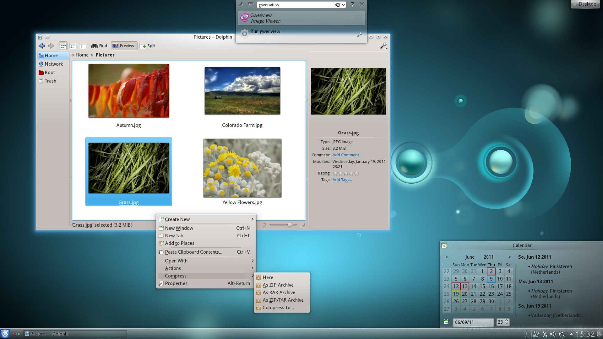
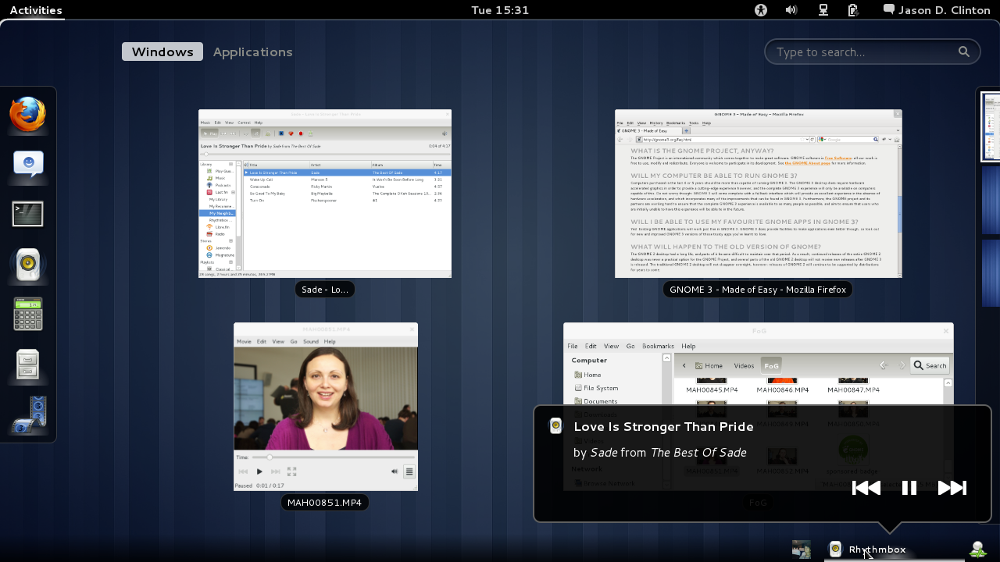

<!-- vim-markdown-toc Redcarpet -->

* [来源](#来源)
* [GTK+简介](#gtk-简介)

<!-- vim-markdown-toc -->

--------------------------------------------------------------------------------------------------------

## 来源

Linux的桌面环境

Linux有一套简便易学的图形用户接口( GUI )，用户使用鼠标就可以完成大多数工作。在Linux中，GUI由窗口系统，窗口管理器，工具包和风格等几个部分组成。窗口系统用于组织显示屏上的图形输出，窗口管理器用于对窗口的操作如最小化等，工具包是用于编程界面的库，风格是应用程序的用户界面。

KDE 与GNOME是目前Linux / UNIX系统最流行的图形操作环境。从上个世纪九十年代中期至今，KDE和GNOME都经历了将近十年的漫漫历程，两者也都从最初的设计粗糙、功能简陋发展到相对完善的阶段，可用性逼近Windows系统。

KDE，K桌面环境(Kool Desktop Environment)的缩写。一种著名的运行于 Linux、Unix 以及FreeBSD 等操作系统上面自由图形工作环境，整个系统采用的都是 TrollTech 公司所开发的Qt程序库（现在属于Digia公司）。

图 1.7  KDE 4.7 桌面环境

GNOME 是GNU Network Object Model Environment(GNU，网络对象模型环境)的缩写，是一种让使用者容易操作和设定电脑环境的工具，GNOME 包含了 Panel （用来启动此程式和显示目前的状态）、桌面 （应用程式和资料放置的地方）、及一系列的标准桌面工具和应用程式，并且能让各个应用程式都能正常地运作。不管之前使用何种操作系统，都能轻易地使用 GNOME 功能强大的图形接口工具。

图 1.8  GNOME 3.0 桌面环境

KDE、GNOME开发所使用的库

KDE是基于Qt库的。Qt是一个1991年由奇趣科技开发的跨平台C++图形用户界面应用程序开发框架。它既可以开发GUI程序，也可用于开发非GUI程序，比如控制台工具和服务器。Qt是面向对象的框架，使用特殊的代码生成扩展（称为元对象编译器(Meta Object Compiler, moc)）以及一些宏，易于扩展，允许组件编程。它提供给应用程序开发者建立艺术级的图形用户界面所需的所有功能。Qt很容易扩展，并且允许真正地组件编程。基本上，Qt 同 X Window 上的 Motif，Openwin，GTK 等图形界 面库和 Windows 平台上的 MFC，OWL，VCL，ATL 是同类型的东西。

GNOME使用的图形库是GTK+工具库。它是是一套在GIMP的基础上发展而来的高级的、可伸缩的现代化、跨平台图形工具包，它可以很方便地制作图形交互界面( GUI )。同时，它遵循 LGPL 许可证，所以用户可以用它来开发开源软件、自由软件，甚至是封闭源代码的商业软件，而不用花费任何钱来购买许可证和使用权。GTK+ 实质上是一个面向对象的应用程序接口 ( API )。尽管完全用 C 写成的，但它是基于类和回调函数 (指向函数的指针) 的思想实现的。具有稳定、跨平台、多种语言绑定、接口丰富、与时俱进、算法丰富、移动嵌入式应用广泛等特点。 

## GTK+简介

GTK+( GIMP Toolkit ) 是一套在 GIMP 的基础上发展而来的高级的、可伸缩的现代化、跨平台图形工具包，提供一整套完备的图形构件，适用于大大小小各种软件工程项目，不论是小到只需要一个窗口，还是复杂得如桌面环境。简单来说，GTK+ 是一种函数库是用来帮助制作图形交互界面的。同时，它遵循 LGPL 许可证，所以用户可以用它来开发开源软件、自由软件，甚至是封闭源代码的商业软件，而不用花费任何钱来购买许可证和使用权。

GTK+ 整个函数库都是由C 语言来编写的。这对 C 爱好者来说是极大的诱惑！你也无需担心因为是 C 写的而担心好用不好用，一旦你熟悉了这样的操作方式，自然会觉得非常好用了！

GTK+ 是一种面向对象式的API(applicationprogramming interface)。Glib 是GTK+的基础，而这种“面向对象系统”正是由“Glib”来提供的。GObject 也就是这种面向对象的机制可以为 GTK+绑定很多种开发语言。目前存在的语言有：C++, Python, Perl, Java, C#，PHP, Go 等其他高级语言。

GTK+ 是最受欢迎的用于图形交互界面（GUI）设计的工具包之一，如开源的桌面环境，大多数都是基于 GTK+ 的，一些商业软件如 Chromium 和 Firefox （Linux 版）均为 GTK+ 画龙点睛。

