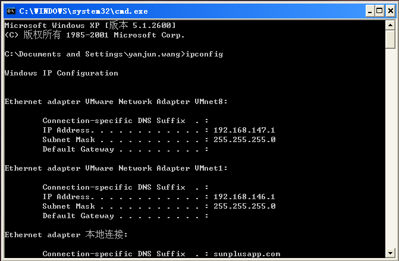
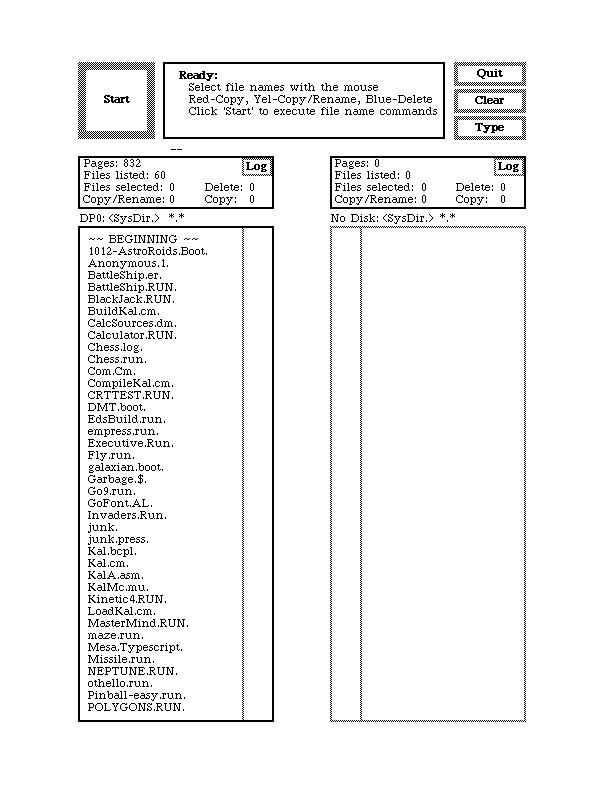
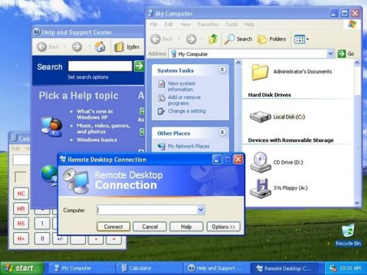
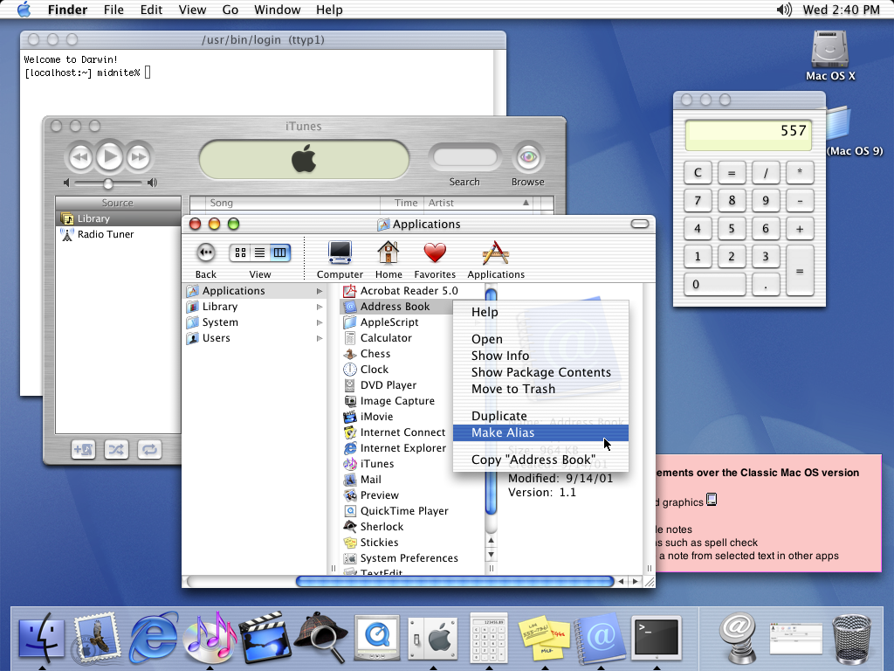
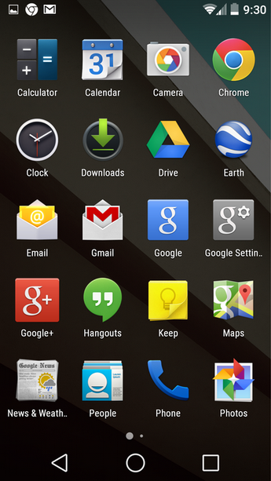
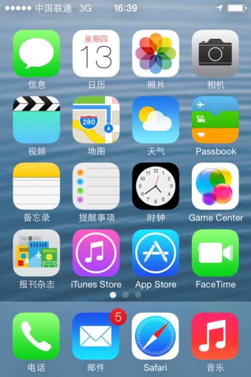

<!-- Docsify/note/IT/GUI -->

* [GTK2](/IT/GUI/GTK2/README.md)

--------------------------------------------------------------------------------------------------------

**GUI简介**

GUI（Graphics User Interface），中文名称为图形用户界面，是指采用图形方式显示的计算机操作用户界面，是计算机与其使用者之间的对话接口，是计算机系统的重要组成部分。 

早期，电脑向用户提供的是单调、枯燥、纯字符状态的“命令行界面（CLI）”，也有人称之为字符用户界面（CUI），如图所示。

由于字符用户界面的操作方式需要用户死记硬背大量的命令，这对于普通用户而言非常不便。后来取而代之的是可以通过窗口、菜单、按键等方式来方便地进行操作。 

下面是GUI的发展及举例：

图 1.2 施乐公司的第一个 GUI 图形用户界面

图 1.3  Windows Xp(2001)

图 1.4  Mac OS X(2001)

图1.5  Android

图1.6  IOS
