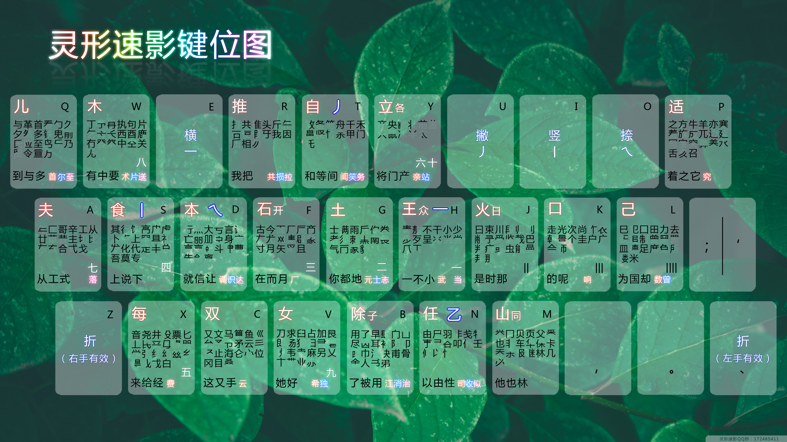

<!-- Docsify/note/IT/Software/Input/LingXingSuYing.md -->

Update: 
2020.10.22

<!-- vim-markdown-toc Redcarpet -->

* [顶功输入法](#顶功输入法)
    - [编码规则](#编码规则)
* [灵形速影输入法](#灵形速影输入法)
    - [灵形速影打字演示](#灵形速影打字演示)
    - [灵形速影键位图](#灵形速影键位图)
    - [打字规则](#打字规则)
        + [一简字打法](#一简字打法)
        + [键名汉字打法](#键名汉字打法)
        + [成字字根打法](#成字字根打法)
        + [两字根成字打法](#两字根成字打法)
        + [多字根成字打法](#多字根成字打法)
        + [两个折字根](#两个折字根)
        + [规则简码](#规则简码)
            * [一级标点简码](#一级标点简码)
            * [二级标点简码](#二级标点简码)
            * [同位码](#同位码)
            * [无理码](#无理码)
        + [笔划字根](#笔划字根)
        + [笔划字根](#笔划字根)
        + [特例](#特例)
    - [拆字规则](#拆字规则)
        + [取大优先](#取大优先)
        + [兼顾直观](#兼顾直观)
        + [字根优先于笔画](#字根优先于笔画)
    - [难拆字](#难拆字)

<!-- vim-markdown-toc -->

--------------------------------------------------------------------------------------------------------

## 顶功输入法

> EK: 下面是介绍顶功输入法，而“灵形速影”属于顶功输入法中的一种,“顶功”只是指这类输入法的“顶上屏“的思路，各顶功输入法可能有所不同。

将键盘分为2个集合，比如：

* 小集合：zeiou以及符号键（z折 e横 i竖 o点 u撇）

* 大集合：余下21个字母

**顶功输入法：** 除了21个空格上屏的一简字以外，其余字都不需要使用空格上屏！而是通过连续输入，后输入的字把前一个字自动“顶”上屏，故把这类输入法称为“顶功”。

### 编码规则

1. 首码为大集合
2. 不存在连续3个大集合
3. 小集合后不存在大集合

也就是：第一码为大集合，第二码为大集合或小集合，三码及三码后为小集合

即，码会出现的情况只会是： 大小 大大 大小小 大大小 大大小小 大大小小小 （EK自加）

* 若前一个字是小集合结尾，接着打下一字首码时输入法检索到空码自动把编码断开，顶字上屏（由第1、3条决定）

* 若前一个字是大集合结尾（此时为2码），接着打下一个字首码时输入法检索到空码自动把编码断开，顶字上屏（由第2条决定）

由于省略了空格，顶功输入法极大地增强了单字效率，打单字的效率远非传统输入法能比。

举例：“顶功输入法”，各字编码如下：

顶wm;

功al

输mdi

入to

法bl

那么在打这句话时，只需要输入wm;almditobl+空格即可，中间是不需要加空格上屏的！由于省略了空格，最终提高了效率，增快了打字速度！几个字或许感觉不出有什么优势，当文章一长，离散文本一多，顶功的优势将会越来越明显！

## 灵形速影输入法

灵形速影就是一款为效率而生的形码顶功输入法，设计于2014-03-10，历时半年多基本定型，后续不断修改完善。本输入法收录了将近7千个单字（GB单字+常用GBK），单字码长最长为5码。

本输入法优势所在：既拥有2千多高频的一二简词+10万左右词组，又拥有着短小犀利的单字码长，不管是文章，还是单字，都能非常高效地完成录入，本输入法的稳定性非常强大，不会随着文本难度的变化而使你的打字水平受影响。本输入法以单字输入为主，词组为辅。即使不打任何词组，对效率影响也不大。

前五百单字：码长：2.0
中五百单字：码长：2.83
后五百单字：码长：2.96
前1500单字：码长：2.60

你可以在短期内学会，并能更快地达到更高的速度。

（只要6-7击键，就能达到单字200字/分以上的速度！

根据每个人练习量不同可能需要三个月——半年时间）

### 灵形速影打字演示

http://www.tudou.com/programs/view/V_b7o8ulnHs/

### 灵形速影键位图

以下规则都基于此键位图。

### 打字规则

便捷查询处：
* zeiou：`e横 i竖 u撇 o点 z折`。
* 左手区estdz：`横e 竖s 撇t 点d 折z`。
* 右手区hiuon：`横h 竖i 撇u 点o 折n`。

#### 一简字打法

上图21个大集合中的每个按键左下角都有2~3个一简字，从左到右的输入方法分别是，`字母 空格`、`字母 ;`、`字母 '`

以按键 f 为例，左下显示有“在”、“而”、“月”三个汉字，他们的打法分别是：

“在”： `f空格`

“而”： `f;`

“月”： `f'`

其它一简字同理。

#### 键名汉字打法

`双击该键`。（即上图每个键的左上角汉字，记住就行）

**共16个汉字：**

儿qq 
木ww 
自tt 
立yy 
夫aa 
食ss 
本dd 
石ff 
土gg 
王hh 
火jj 
口kk 
己ll 
每xx 
女vv 
山mm

#### 成字字根打法

> 成字字根的意思即是该字本身就是字根，或者反过来说字根本身代表的汉字。

`该字(根)所在键 + 该字第一笔画（分左右手） + [第二笔画(zeiou) + 第三、四...]`

**详解：**

第二个键（即第一笔画）中分左右手的意思是，如果第一个键（字根）在左手，则第二个键要在右手区中按对应的第一笔画，反之亦然，左手是estdz `横e 竖s 撇t 点d 折z`，右手是hiuon `横h 竖i 撇u 点o 折n`。

如果输入完两码还没有出现需要的字，则需要向后逐个补充输入第三、四、五码（即第二、三、四笔画），直到所需字出现（最多5码），三、四、五码使用的都是zeiou输入笔画。（即只有第二码区分左右手）

#### 两字根成字打法

`第一字根 + 第二字根 + [第二字根的末笔笔画zeiou + 第二字根的末笔笔画zeiou ... ]`

如：“知” = “矢” + “口” = f + k

若第二字根为横竖撇点折，则使用上面说过的 右手hiuon或者左手estdz，如果不理解可看上面的“成字字根打法”。如：“重” = “重”（字根是少了中间的一竖） + “丨” = q + i

如果二码不出现所需字，则第三码开始输入“第二字根的末笔笔画“(zeiou)，如果还不出现，则重复输入“第二字根的末笔笔画“(zeiou)，直至出现。

“路” = “足” + “各” = l + y

#### 多字根成字打法

`第一字根 + 第二字根 + [第三字根的首笔笔画zeiou + 后续笔画zeiou ... ]`

> 最后的“后续笔划”是指第三字根的后续笔划还是“第三字根以外的后续笔划”？

多字根成字和两字根成字思路一样，区别在于第三码开始，如果输入前两个字根还未出现，则输入第三字根的首笔笔画zeiou，如果还不出现，则继续输入第三字根的后续笔画zeiou。

如：

“便” = “单人旁” + “一”(横) = n + e(左手横)

“置” = “罒” + “十” + "丨"(竖) = l + y + i

“踣“ = “足” + “立” + "丨"(竖) + “折”= l + y + i + z （最后的竖折是“口”字根的第一二笔画） 

#### 两个折字根

两个折字根的意思是指包含连续两个折的字。

键位图上有左右两个折字根 “z“ 和 “/“

若折之前是左手字根，则待输入的折键位是右手的折“/“。

若折之前是右手字根，则待输入的折键位是左手的折“z“。

如： “苍“ = ”艹“ + ”人“ + ”折(右手)“ + ”折(左手) = a + b + / + z

z上的折代表一切折的结构（乙乚乛），但是当二简时，z上折仅有乙、乚两种结构，此时“n“包含“乛“。（候nz可看做nze的简码）（EK：不解）

如：

瓦hz = “一(横)“ + “乚(左下角)“ = h + z （因为首码不能是笔画横（小集合），必须是字根“一“h）

叫kz = “口” + “乚” = k + z

电jz = “日” + “乚” = j + z

思lz = “田” + “折(心字底)“ = l + z

巴jn = “巴” + “折(乛)” = j + n

力ln = “力” + “折()” = l + n

#### 规则简码

EK：简码的意思就是在原来可以打出来的，码长比较大的字，再给它编一个简码，通过输入简码同样可以把它打出来的意思。

为了合理利用空间，增加效率，选取部分高频字作为规则简码字。

EK：灵形速影作者把简码定义和分为下面4类

* 一级标点简码(36个)
* 二级标点简码(共17个)
* 同位码(26个)
* 无理码(11个)

二、三、四级字上的规则简码字，第三码不打zeiou,而打`;` `'`

> 什么叫“二、三、四级字”？

即 `;` 是用于左右结构字，`'` 用于非左右结构字。

如：

敲 `sk;`

帮 `jb'`

规则简码字多为高频字，比较容易记忆。

##### 一级标点简码

, 横撇

. 竖

/ 点折

看第二字根首笔，成字字根看第二码。

**36个一级标点简码：**

| 汉字 | 一级标点简码 | 正码 |
| ---  | ---          | ---  |
| 消   | b.           |      |
| 江   | b,           | 无   |
| 治   | b/           |      |
| 云   | c,           | 无   |
| 调   | d,           |      |
| 识   | d.           |      |
| 达   | d/           |      |
| 元   | g,           |      |
| 士   | g.           |      |
| 志   | g/           |      |
| 武   | h,           |      |
| 响   | k,           |      |
| 数   | l,           |      |
| 曾   | l.           |      |
| 司   | n,           |      |
| 收   | n.           |      |
| 似   | n/           |      |
| 究   | p,           |      |
| 至   | q/           |      |
| 首   | q,           |      |
| 尔   | q.           |      |
| 共   | r,           |      |
| 拉   | r/           |      |
| 务   | t/           |      |
| 闻   | t,           |      |
| 希   | v,           |      |
| 独   | v.           |      |
| 送   | w/           |      |
| 片   | w.           |      |
| 亲   | y,           |      |
| 站   | y.           |      |
| 费   | x,           |      |
| 落   | a/           |      |
| 厂   | f,           |      |
| 损   | r.           |      |
| 当   | h/           |      |

##### 二级标点简码

二级标点简码：即通过`前两码+标点`形成的简码，代替原来较长的正码，达到提高打字速度的目的。

`'` 横撇折 `/` 竖点

看第三字根首笔，两字根成字取末码笔画。

**3个二级标点简码：**

> 只需要记忆3个无正码的二级标点简码（其它不用记？因为就算不记得简码，也可以通过正码输入那些字）

**二极标点简码：**

| 汉字 | 简码 | 正码 |
| ---  | ---  | ---  |
| 阴   | bf'  | 无   |
| 浓   | bp'  | 无   |
| 洲   | bj/  | bjoo |
| 铺   | qb/  | qbo; |
| 批   | ra'  | rauz |
| 伯   | nx'  | nxee |
| 挥   | rp'  | rpe/ |
| 陷   | bq'  | bqui |
| 倾   | na'  | naeu |
| 扎   | rn'  | rnz/ |
| 际   | bd'  | bduo |
| 涌   | bc/  | bciz |
| 途   | bt/  | btoz |
| 恐   | am/  | amoz |

**特殊：**

| 汉字 | 简码 | 正码 |
| ---  | ---  | ---  |
| 羊   | pd/  | pdue |
| 污   | bh/  | bhe/ |
| 沿   | bm'  | 无   |

##### 同位码

同位规则：就是`该字的第一码+同位识别码`。

识别码：
* 如果第一字根在左手，则识别码为左手区域的E。
* 如果第一字根在右手，则识别码在右手区域，然后看该字的第一笔，横撇为U、竖为I、点折为O。

> 因为如果第一字根在左手，则选左边的识别码(E)，在右手则右边的识别码(U、I、O)，所以称这类字为“**同位规则**”。

**26个同位规则打法：**

| 汉字 | 同位码 |
| ---  | ---    |
| 商   | fe     |
| 据   | re     |
| 微   | se     |
| 紧   | te     |
| 院   | be     |
| 些   | ce     |
| 造   | de     |
| 未   | ge     |
| 久   | qe     |
| 根   | we     |
| 绝   | xe     |
| 业   | ve     |
| 爱   | ju     |
| 父   | mu     |
| 体   | nu     |
| 直   | yu     |
| 政   | hu     |
| 图   | li     |
| 装   | yi     |
| 品   | ki     |
| 底   | ko     |
| 举   | mo     |
| 展   | no     |
| 完   | po     |
| 况   | yo     |
| 已   | lo     |

##### 无理码

无理码，就是没什么拆解规律可言的，死记硬背就行。

**11个无理打法：**

| 汉字 | 无理码 |
| ---  | ---    |
| 议   | dz     |
| 喜   | gz     |
| 热   | wz     |
| 飞   | ni     |
| 低   | di     |
| 术   | w,     |
| 笑   | t.     |
| 段   | jo     |
| 兄   | ku     |
| 证   | ae     |
| 请   | ho     |

#### 笔划字根

笔划字根（EI）

丨sii

丿tii

丶乁乀dii

乙〇乚乛nee

#### 笔划字根

平衡字根（AO）

左手键位，次码为O；右手键位，次码为A。

左手：子bo  开fo

右手：同ma  日ja  各ya  众ha

#### 特例

> 这个的规律是什么？也是无理码吗？

特例（同位取码）：尽bt  群vt 若at 存fs

### 拆字规则

#### 取大优先

尽量取大字根，如“高”打法为sk,第一个字根为：“高字去掉‘口’”（在S键上），第二字根为口（在K键上）。而不是拆为：“高字只有最上面的‘点横口’” +冂+口。

#### 兼顾直观

要考虑实际字根的组合，如“丧”打法为yye，拆为：十+“两点” +“丧字底” ，所以第三码为e，而不是z。 

#### 字根优先于笔画

并不完全按照标准笔画来打，要考虑实际字根组合，如心nc 字根组合为 折+三点，那么第一笔就算作折，而不是点。所以“恐”字的打法：amoz而不是amoo

### 难拆字

| 难拆字 | 无理码                                     |
| ---    | ---                                        |
| 保     | mk                                         |
| 半     | sy                                         |
| 州     | jd                                         |
| 长     | wi （次笔看作竖）                          |
| 卫     | xnz                                        |
| 书     | sb                                         |
| 太     | f+两点                                     |
| 再     | hw                                         |
| 已     | 己+丶                                      |
| 代     | so=化+丶                                   |
| 世     | kf=〣+三                                   |
| 右     | tr=丿+其余部分                             |
| 凹     | hbe=一+凵+一                               |
| 凸     | hm'=一+几+一                               |
| 空     | p（宝盖头）+w                              |
| 甘     | 艹+二                                      |
| 贵     | kx’=口+"上字没有最后一横" +贝             |
| 年     | ak= "年的中间没有一竖" +  （歪点的）“个” |

--------------------------------------------------------------------------------------------------------

未完待续<++>

还有部分内容未写上来，以及群里面单独下载的PDF教程，暂时先不完成了，因为觉得这个输入法录入速度可能是很快，但是有点不规律，无规则可寻（或者说规则纵横交错，过于复杂）。感觉有点偏离初心了，先搁置，看看徐码怎么样先。（但是徐码没有顶功。。。这就比较郁闷了，因为据说顶功快很多，我想要一个规则又科学的，同时如果能顶功的、快的就更好的）

这些未整理的内容我会存在电脑内，或者是网盘内，以后再说了。
