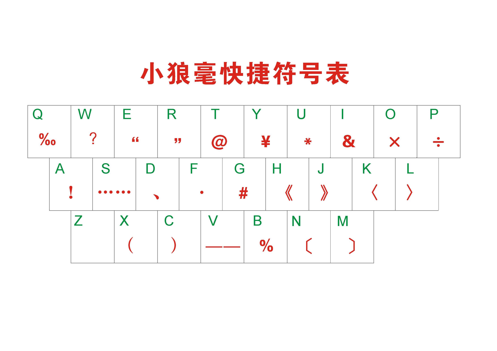
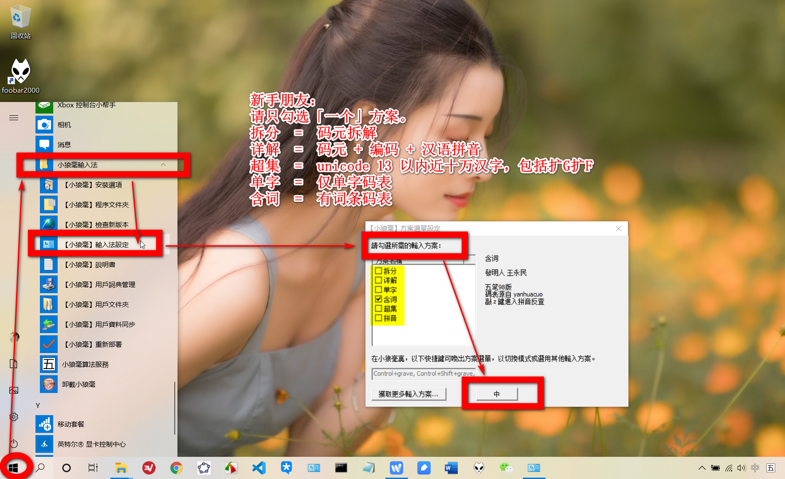

<!-- vim-markdown-toc Redcarpet -->

* [小浪五笔98版](#小浪五笔98版)
    - [快捷标点符号](#快捷标点符号)
* [Rime-小狼毫98专版](#rime-小狼毫98专版)
    - [设置](#设置)
    - [特色功能](#特色功能)
    - [基础功能](#基础功能)
    - [三大开关](#三大开关)
    - [快捷标点符号](#快捷标点符号)

<!-- vim-markdown-toc -->

## 小浪五笔98版

* 使用 分号`;` 引号`'` 可以选第 2、3 候选字

### 快捷标点符号

1. 按分号`；`再按下图其中一个按键，即可输入对应标点符号。

> 这图是Rime输入法Windows版——小狼毫的，但是不知为何在小浪五笔也能用。

2. 按`zz`可弹出特殊符号输入列表

 

--------------------------------------------------------------------------------------------------------

## Rime-小狼毫98专版

这个输入法是我在五笔爱好者论坛上下载的，推测是五笔98爱好者使用Rime自制的五笔98输入法，很多东西都设置好，装好就可以直接使用。

> 这里只记录98专版的内容。本体输入法Rime学习成本高，由于内容太多所以不打算记录在这里。以后抽时间系统学习后，再在`Docsify/note/IT/Software/Input/`下建一个“Rime笔记”记录。

### 设置

### 特色功能

* 拆分提示：`Ctrl + Shift + H`，打开后边输入文字会边提示该字的拆分结构，再按一次关闭。

* 按`z`键可临时使用拼音输入下一个字

* `~`以形查音：按`~`键后，输入下一个字后会提示该字拼音。

* 「`」引导精准造词

> EK测试：配图使用中文名

* 「Z」兼俱重复历史输入：如有上屏记录，按「Z」键时，会提示上次输入历史。

### 基础功能

* 回车清屏
* Shift + 回车 = 编码上屏
* Shift = 中英切换
* Ctrl + ~ = 切换方案
* 使用 分号`;` 引号`'` 可以选第 2、3 候选字

### 三大开关

    Ctrl + Shift + H = 拆分提示开关

    Ctrl + Shift + F = 繁简转换开关

    Ctrl + Shift + U = 字符集过滤开关

### 快捷标点符号

网上找到下图，但是不知道怎么触发。

