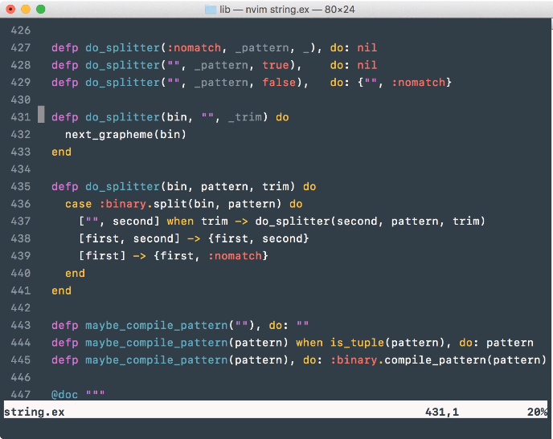
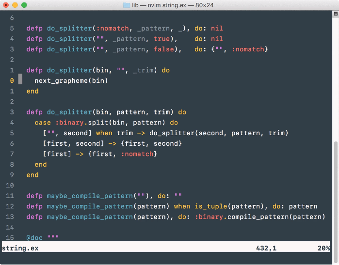
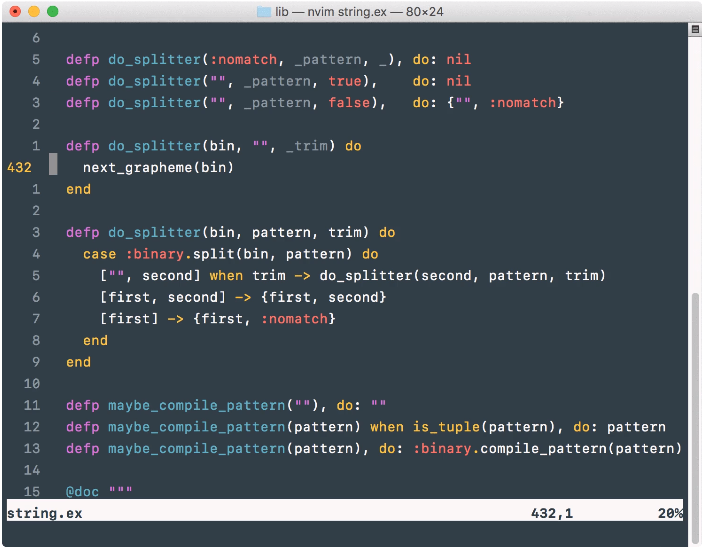
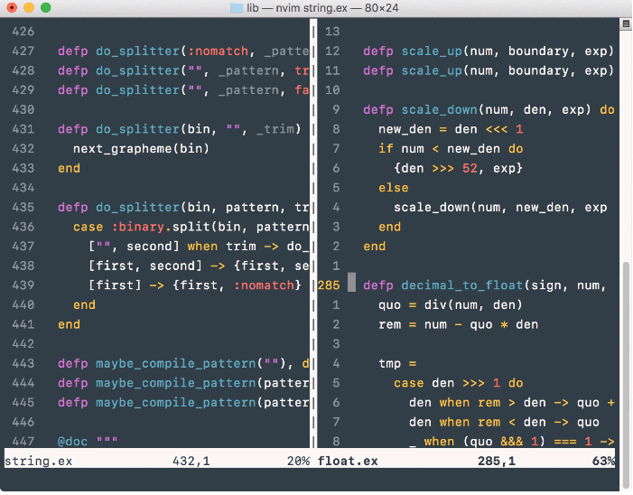

<!-- vim-markdown-toc Redcarpet -->

* [加载设置文件](#加载设置文件)
* [语法高亮](#语法高亮)
* [显示行号](#显示行号)
* [按行号跳转](#按行号跳转)
* [拼写检查（英语）](#拼写检查（英语）)
    - [Operations in Normal Mode](#operations-in-normal-mode)
    - [Fix Spelling Errors from Insert Mode](#fix-spelling-errors-from-insert-mode)
* [当前文件转换为html格式输出](#当前文件转换为html格式输出)
* [更改文件编码](#更改文件编码)
    - [查看当前文件的编码格式](#查看当前文件的编码格式)
    - [更改当前文件的编码格式](#更改当前文件的编码格式)

<!-- vim-markdown-toc -->

---

## 加载设置文件

```VimScript
:source 文件名
```
例如加载默认路径下的vimrc文件 `:source $MYVIMRC` 。

---

<br>

## 语法高亮

```VimScript
:syntax on
```

---

<br>


## 显示行号

使Vim在每一行前面显示行号。

[参考链接](https://jeffkreeftmeijer.com/vim-number/)

**注：下方的每行命令中的第二行均为第一行的缩写！效用相同。** <++>

* **方案一：absolute**

所有行按照它的真实行号来显示。

效果图：



```VimScript
" turn absolute line numbers on
set number
set nu

" turn absolute line numbers off
set nonumber
set nonu

" toggle absolute line numbers
set number!
set nu!
```

* **方案二：relative**

以当前行号为基准（显示为0，实际不为0），其它行号为当前行号的相对值。

效果图：



```VimScript
" turn relative line numbers on
set relativenumber
set rnu

" turn relative line numbers off
set norelativenumber
set nornu

" toggle relative line numbers
set relativenumber!
set rnu!
```

* **方案三：hybrid**

当前行号是绝对值，其它行号为当前行号的相对值。（推荐）

效果图：



```VimScript
" turn hybrid line numbers on
set number relativenumber
set nu rnu

" turn hybrid line numbers off
set nonumber norelativenumber
set nonu nornu

" toggle hybrid line numbers
set number! relativenumber!
set nu! rnu!
```

* 分屏行号设置

如果需要分屏，两屏使用相同的方案显示行号。

可以改成如下图所示的，活动窗口以hybrid方案显示，非活动窗口以absolute方案显示。（推荐）



```
" 设为hybrid方案
set nu rnu

" 分屏的时候，非活动窗口的行数显示设为绝对值，活动窗口的行数保持相当值
augroup numbertoggle
  autocmd!
  autocmd BufEnter,FocusGained,InsertLeave * set relativenumber
  autocmd BufLeave,FocusLost,InsertEnter   * set norelativenumber
augroup END
```

## 按行号跳转

```VimScript
:行号(数字)
```

在上面命令中填入要到达的行号即可。

> 例如`:31`，即跳转到第31行。


## 拼写检查（英语）

```VimScript
" 开启spell check
:set spell

" 关闭spell check
:set nospell
```

[参考链接](https://vimjc.com/vim-spell-check.html)

Vim 内置拼写检查器，使用命令 `:set spell` 可以对当前文件中所有未在字典中出现过的单词进行标记并高亮显示。

* **开/关拼写检查功能** `map <LEADER>sc :set spell!<CR>` （spell check）

<br>

### Operations in Normal Mode

开启功能后，可以使用以下快捷键：

| Command | effect                                       | 备注    |
| :---:   | :---:                                        | :---:   |
| ]s      | 跳转到下个拼写错误                           |         |
| [s      | 跳转到上个拼写错误                           |         |
| z=      | 当前单词的推荐集合（需光标移至错误单词上方） |         |
| zg      | 添加单词到拼写文件                           | `:h zg` |
| zw      | 从拼写文件删除当前单词                       |         |
| zug     | 撤销对当前单词的 zg 或 zw修改                |         |

`z=`： Vim的拼写检查提供修改建议功能，把光标移动到标记为拼写错误的词上方，按`z=`会出现修改建议，按数字选择需要的建议即可完成自动修改。

`zg`： Vim 有时会错误的把一些词标记为拼写错误, 是因为该词未收录在词典中。把光标移动到需要添加的词上方，使用 `zg` 命令(参考 :h zg)把光标处的词添加到拼写文件来教 Vim 识别该词。

`zw`： Vim 还提供了一个互补的 `zw` 命令, 可以把光标处的单词标记为拼写错误。 

`zug`： 事实上, `zg` 或 `zw` 命令, 会添加或删除拼写文件中的单词。 Vim 为这种情况提供了专用的 `zug` 撤销命令, 它可以恢复对光标下单词的`zg` 或 `zw` 命令的操作

> Vim 在拼写文件中记录添加到字典的单词, 以便它们在其他会话中也可以使用. 拼写文件的名称是用语言和文件编码命名的。

> 例如, 如果我们正在使用UTF-8编码的文件, 并且拼写检查器使用英语词典, 则使用 zg 命令添加的单词将会记录在名为 ~/.vim/spell/en.utf-8.add 的文件中

<br>

### Fix Spelling Errors from Insert Mode

 我们可以在插入模式使用 `<C-x>s`(参考 `:h compl-spelling`) 命令来修复此错误, 它会触发一个弹出的自动补菜单可供选择。
 
可供弹出式菜单使用的命令

| Command   | effect                     | 备注          |
| :---:     | :---:                      | :---:         |
| <C-n>     | 下一个项(next)             |               |
| <C-p>     | 上一个项(previous)         |               |
| <C-y>     | 确认使用当前选中的项(yes)  |               |
| <C-e>     | 还原最早输入的文本(exit)   |               |
| <C-h>     | 从当前匹配项中删除一个字符 |               |
| <C-l>     | 从当前匹配项中增加一个字符 |               |


## 当前文件转换为html格式输出

```VimScript
:%TOhtml
```

---

<br>

## 更改文件编码

### 查看当前文件的编码格式

```VimScript
:set fileencoding
```

> 正常情况下，Vim的状态栏会有显示当前正在编辑的文件采用的编码格式（在右下角）。

### 更改当前文件的编码格式

```VimScript
:set fileencoding=utf-8
```

> `utf-8`可改为其它编码格式。
